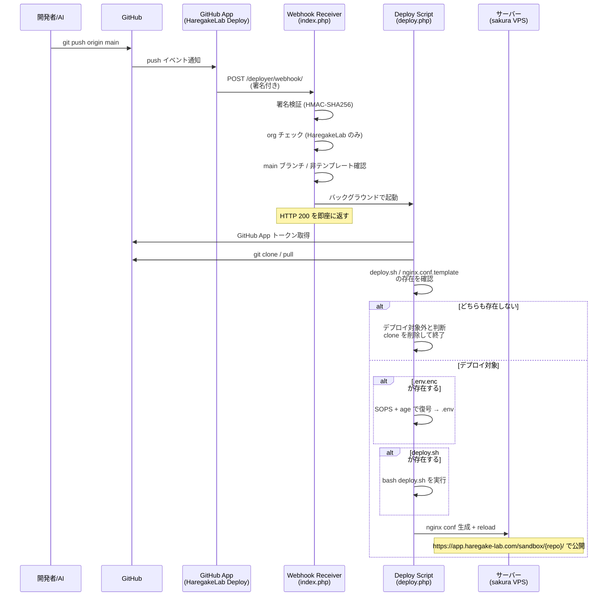

# デプロイ（公開）

## 仕組み

main ブランチに push すると、サーバーが自動でデプロイします。



## 公開 URL

`https://app.haregake-lab.com/sandbox/リポジトリ名/`

- リポジトリ名がそのまま URL のパスになります
- サンドボックスなのでアクセスにはユーザー名とパスワードが必要です

## やること

AI に「公開して」と伝えるだけ。AI が以下を実行します:

```bash
git add -A
git commit -m "変更内容の説明"
git push origin main
```

push 後 1〜2 分で自動デプロイが完了します。

## デプロイの確認

### デプロイログ

デプロイの進行状況やエラーは、ブラウザで確認できます。

`https://app.haregake-lab.com/deployer/logs/リポジトリ名/`

サンドボックスのユーザー名とパスワードが必要です。

### サーバー上のファイル確認

デプロイされたアプリのファイル（`.env` やログファイル等）をブラウザで閲覧できます（読み取り専用）。

`https://app.haregake-lab.com/deployer/files/リポジトリ名/`

デプロイ後にアプリが動かないときは、ここで `.env` の設定値や `storage/logs/laravel.log` のエラーを確認してください。
